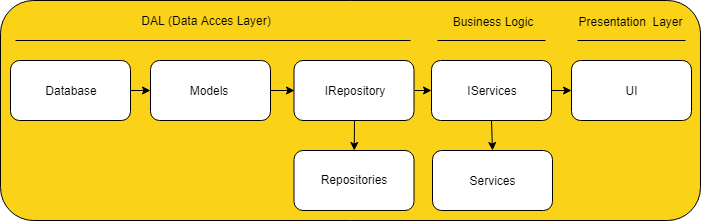

# SC2002 OODP 
## BTO Management System

<div class="opacity-75">
Group 1 | 22 April 2025
</div>


---
layout: intro
---

# Our Team <span class="ml-2 opacity-80"><i-carbon-group-account /></span>

<div class="grid grid-cols-5 gap-4 text-center mt-12">
  <!-- Column 1 -->
  <div>
    
    <p class="font-semibold">Tang Xinbo</p>
    <p class="text-xs opacity-70">Tester</p>
  </div>
  <!-- Column 2 -->
  <div>
    
    <p class="font-semibold">Teo Wei Xiang</p>
    <p class="text-xs opacity-70">Team Leader</p>
  </div>
  <!-- Column 3 -->
  <div>
    
    <p class="font-semibold">Toh Xin Yi</p>
    <p class="text-xs opacity-70">Programmer</p>
  </div>
  <!-- Column 4 -->
  <div>
    
    <p class="font-semibold">Vishal JG</p>
    <p class="text-xs opacity-70">Programmer</p>
  </div>
  <!-- Column 5 -->
  <div>
    
    <p class="font-semibold">Murugaraj Vishvaajit</p>
    <p class="text-xs opacity-70">Documenation</p>
  </div>
</div>


---
layout: default # Standard layout
---

# Approach

<v-clicks>

* <span class="text-xl mr-1"><carbon-layers /></span> **Layered Architecture:** Decomposed the system into View, Controller, Service, Repository, Entity layers for <span v-mark.highlight.teal>Separation of Concerns</span>.

* <span class="text-xl mr-1"><carbon-connect-source /></span> **Abstraction & Interfaces:** Defined `IService` and `IRepository` interfaces to enable <span v-mark.highlight.orange>Loose Coupling</span> (DIP/ISP).

* <span class="text-xl mr-1"><carbon-rule /></span> **Design Patterns:** Applied the <span v-mark.underline.blue>Repository Pattern</span> for data access (CSVs) and Composition via <span v-mark.underline.purple>UI Helpers</span> for view logic reuse.

* <span class="text-xl mr-1"><carbon-cube /></span> **Modularity:** Resulting in maintainable and testable components.

</v-clicks>

---
layout: default
---

#  High-Level Architecture:

<div v-after class="mx-auto text-center mt-4">
  
</div>

<br/>

1. **View Layer:** User interface components (CLI) for user interaction.
2. **Controller Layer:** Handles user input, coordinates between View and Service layers.
3. **Service Layer:** Business logic and application flow management.
4. **Repository Layer:** Data access layer for CSV file operations.
5. **Entity Layer:** Represents core data structures (e.g., Application, Booking).


---
layout: center
class: text-center
---

# Feature Walkthrough <span class="text-2xl"><carbon-video /></span>
**(Live Demo)**

**Scenario:** BTO Success

<div class="text-left">

- Project: "Maple Grove" (PROJ002) - Created by T4000001F, Visible: ON, Application Period: Active (e.g., Apr 1 - Apr 30, today is Apr 15), Offers ONLY TWO_ROOM (80 total, 80 remaining), No approved officers yet.
- Applicant: Bob Lee (S1000002B) - Married, 30yo, No active application.
- Officer: Charlie Tan (T3000001D) - No active application, No registrations.
- Manager: Alice Lim (T4000001F) - Manager for PROJ002.

</div>

---
layout: default
---

# Design & OOD Justification

*   **Architecture:** <span v-mark.highlight.cyan>Layered Design</span> (View-Controller-Service-Repository) reviewed - promotes maintainability.
*   **Key Patterns:**
    *   <span v-mark.underline.blue>Repository Pattern</span>: Abstracted CSV access via `IRepository`. Consistent interface for data operations.
    *   <span v-mark.underline.purple>UI Helpers (Composition)</span>: Reusable display logic (e.g., `ProjectUIHelper`). Reduced duplication in main UI classes.
*   **Interfaces:** Decoupled layers -> <span v-mark.highlight.green>Testability & Flexibility</span>.

<br/>

**Entity Decisions:**
*  **Application & Booking:** Clear separation reflecting workflow stages.
*  **Applicant Preference:** Added `preferredFlatType` to `Application` for better workflow context non-binding.


---
layout: default
---

# SOLID Principles Applied <span class="text-2xl"><carbon-rule-test /></span>

*   **S**RP: Focused components like `AuthenticationService`, `BookingService`.
*   **O**CP: Services closed to modification but open to extension via `IRepository` implementations.
*   **L**SP: `User` subtypes (`Applicant`, `HDBStaff`) used where `User` is expected.
*   **I**SP: Specific interfaces like `IApplicationService`, `IBookingService` prevent unnecessary dependencies.
*   **D**IP: Controllers/Services depend on abstractions (`IService`, `IRepository`), not concrete classes.

```java
public class ProjectService implements IProjectService {
    private final IProjectRepository projectRepo;
    private final IEligibilityService eligibilityService;
    private final IApplicationRepository applicationRepo;
    private final IOfficerRegistrationRepository officerRegRepo;

    public ProjectService(IProjectRepository projectRepo, IEligibilityService eligibilityService,
            IApplicationRepository applicationRepo, IOfficerRegistrationRepository officerRegRepo) {
        this.projectRepo = projectRepo;
        this.eligibilityService = eligibilityService;
        this.applicationRepo = applicationRepo;
        this.officerRegRepo = officerRegRepo;
    }
}
```

---
layout: default
---

# Testing Overview <span class="text-2xl"><carbon-debug /></span>

* **Approach:** <span v-mark.underline.blue>Manual Testing</span> based on Use Cases & Requirements/FAQ.
* **Focus:** Positive Paths, **<span v-mark.highlight.red>Error Handling</span>**, Business Rules, Edge Cases.

<br/>

**Test Case Coverage Examples:** *(Referencing Demo)*
*  <span class="text-lime-600 mr-1">✓</span>   Logins (Valid/Invalid) & Role Permissions
*  <span class="text-lime-600 mr-1">✓</span>  **Input Validation:** <span v-mark.circle.orange>NRIC, IDs, Selections, Empty</span>
*  <span class="text-lime-600 mr-1">✓</span>   State Transitions (Application/Registration Statuses)
*  <span class="text-lime-600 mr-1">✓</span>   Business Rules: <span v-mark.circle.purple>Single App Limit, Reg Conflicts, Unit Counts</span>
*  <span class="text-lime-600 mr-1">✓</span>   Data Persistence (CSV Load/Save)


---
layout: center
class: text-center
---

# Conclusion <span class="text-3xl text-green-500"><carbon-checkmark-outline /></span>

<div class="text-xl mt-4">
Successfully developed a CLI BTO Management System applying <span v-mark.highlight.teal>OO principles</span> for a <span v-mark.highlight.lime>modular</span> and <span v-mark.highlight.lime>robust</span> design, meeting core requirements.
</div>

---
layout: center
class: text-center
---

# Thank You

<div class="text-2xl my-4">
Q & A
</div>