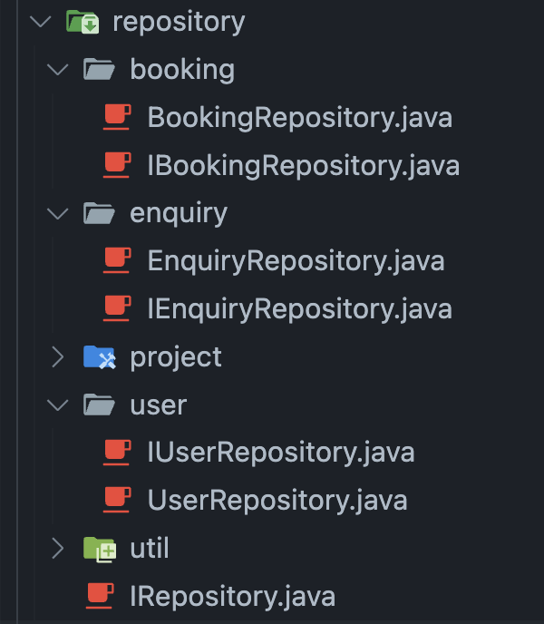

# SC2002 OODP 
## BTO Management System

<div class="opacity-75">
Group 1 | 22 April 2025
</div>


---
layout: intro
---

# Our Team <span class="ml-2 opacity-80"><i-carbon-group-account /></span>

<div class="grid grid-cols-5 gap-4 text-center mt-12">
  <!-- Column 1 -->
  <div>
    
    <p class="font-semibold">Tang Xinbo</p>
    <p class="text-xs opacity-70">Tester/Designer</p>
  </div>
  <!-- Column 2 -->
  <div>
    
    <p class="font-semibold">Teo Wei Xiang</p>
    <p class="text-xs opacity-70">Team Leader</p>
  </div>
  <!-- Column 3 -->
  <div>
    
    <p class="font-semibold">Toh Xin Yi</p>
    <p class="text-xs opacity-70">Programmer</p>
  </div>
  <!-- Column 4 -->
  <div>
    
    <p class="font-semibold">Vishal JG</p>
    <p class="text-xs opacity-70">Programmer</p>
  </div>
  <!-- Column 5 -->
  <div>
    
    <p class="font-semibold">Murugaraj Vishvaajit</p>
    <p class="text-xs opacity-70">Tester/Designer</p>
  </div>
</div>

---
layout: default # Standard layout
---

# Approach

<v-clicks>

* <span class="text-xl mr-1"><carbon-layers /></span> **Layered Architecture:** Decomposed the system into View, Controller, Service, Repository, Entity layers for <span v-mark.highlight.teal>Separation of Concerns</span>.

* <span class="text-xl mr-1"><carbon-connect-source /></span> **Abstraction & Interfaces:** Defined `IService` and `IRepository` interfaces to enable <span v-mark.highlight.orange>Loose Coupling</span> (DIP/ISP).

* <span class="text-xl mr-1"><carbon-rule /></span> **Design Patterns:** Applied the <span v-mark.underline.blue>Repository Pattern</span> for data access (CSVs) and Composition via test test <span v-mark.underline.purple>UI Helpers</span> for view logic reuse.

* <span class="text-xl mr-1"><carbon-cube /></span> **Modularity:** Resulting in maintainable and testable components.

</v-clicks>

---
layout: default
---

#  High-Level Architecture:

<div v-after class="mx-auto text-center mt-4">
  
</div>

<br/>

1. **View Layer:** User interface components (CLI) for user interaction.
2. **Controller Layer:** Handles user input, coordinates between View and Service layers.
3. **Service Layer:** Business logic and application flow management.
4. **Repository Layer:** Data access layer for CSV file operations.
5. **Entity Layer:** Represents core data structures (e.g., Application, Booking).

---
layout: default
---

# Design & OOD Justification

*   **Architecture:** <span v-mark.highlight.cyan>Layered Design</span> (View-Controller-Service-Repository) reviewed - promotes maintainability.
*   **Key Patterns:**
    *   <span v-mark.underline.blue>Repository Pattern</span>: Abstracted CSV access via `IRepository`. Consistent interface for data operations.
    *   <span v-mark.underline.purple>UI Helpers (Composition)</span>: Reusable display logic (e.g., `ProjectUIHelper`). Reduced duplication in main UI classes.
*   **Interfaces:** Decoupled layers -> <span v-mark.highlight.green>Testability & Flexibility</span>.

<br/>

**Entity Decisions:**
*  **Application & Booking:** Clear separation reflecting workflow stages.
*  **Applicant Preference:** Added `preferredFlatType` to `Application` for better workflow context non-binding.

---
layout: default
---

# SOLID Principles: SRP <span class="text-2xl"><carbon-rule-test /></span>

*   **S**ingle **R**esponsibility **P**rinciple (SRP):
    *   A class should have only one reason to change.
    *   *Example:* `Booking` entity holds booking data (unit, date, applicant). `BookingService` handles the *logic* of creating, validating, and managing bookings. Changes to booking *data structure* affect `Booking`; changes to booking *rules* affect `BookingService`.

```java
// Booking Entity (Data)
public class Booking {
    private String bookingId;
    // ... other fields like unitId, applicantNric, bookingDate ...
}

// Booking Service (Logic)
public class BookingService implements IBookingService {
    private final IBookingRepository bookingRepo;
    // ... other dependencies ...

    public Booking createBooking(...) { /* Logic here */ }
    public void cancelBooking(...) { /* Logic here */ }
}
```

---
layout: default
---

# SOLID Principles: OCP <span class="text-2xl"><carbon-rule-test /></span>

*   **O**pen/**C**losed **P**rinciple (OCP):
    *   Software entities should be open for extension, but closed for modification.
    * *Example:* Our Services depend on Repository Interfaces (IRepository, IProjectRepository).
      * This means the Services are closed for modification regarding data storage details.
      * The system is open for extension because we could add a new Database Repository implementing IProjectRepository in the future, and swap it in during initialization, without ever changing the existing Service code.

---
layout: default
---

# SOLID Principles: LSP <span class="text-2xl"><carbon-rule-test /></span>

*   **L**iskov **S**ubstitution **P**rinciple (LSP):
    *   Objects of a superclass should be replaceable with objects of its subclasses without affecting the correctness of the program.
    *   *Example:* `Applicant`, `HDBOfficer` and `HDBManager` inherit from `User`. Methods accepting a `User` (like `App.routeToRoleUI` or `AuthenticationService.login`) can correctly handle instances of `Applicant` or `HDBStaff` because they fulfill the `User` contract.

```java
private void routeToRoleUI(User user) {
  switch (user.getRole()) {
      case APPLICANT:
          ApplicantUI applicantUI = new ApplicantUI(
            (Applicant) user, ...);
            break;

      case HDB_OFFICER:
          HDBOfficerUI officerUI = new HDBOfficerUI(
            (HDBOfficer) user, ...);
            break;
  }
}
```

---
layout: two-cols
---

# SOLID Principles: ISP <span class="text-2xl"><carbon-rule-test /></span>

*   **I**nterface **S**egregation **P**rinciple (ISP):
    *   Clients should not be forced to depend on methods they do not use. Prefer smaller, specific interfaces over large, general ones.

    *   *Example:* `IRepository` has methods like `findAll()`, `findById()`, and `save()`.

    * Then for the `BookingRepository`, we have `IBookingRepository` with methods like `findByProjectId()`. This way, classes only implement the methods they need.

::right::



---
layout: default
---

# SOLID Principles: DIP <span class="text-2xl"><carbon-rule-test /></span>

*   **D**ependency **I**nversion **P**rinciple (DIP):
    *   High-level modules (e.g., business logic - `ProjectService`) should not depend on low-level modules (e.g., data access - `ProjectRepository`).
    *   *Example:* `ProjectService` depends on interfaces like `IProjectRepository` and `IEligibilityService`. Concrete implementations are provided (injected) via the constructor, decoupling the service logic from specific data storage or eligibility rule implementations.

```java
public class ProjectService implements IProjectService {
    // Dependencies are interfaces (abstractions)
    private final IProjectRepository projectRepo; // passed in via constructor
    // ... other interface dependencies

    // Methods use the abstractions, unaware of concrete implementations
    public List<Project> getVisibleProjects() {
        return projectRepo.findAll().stream() // Uses IProjectRepository
                .filter(Project::isVisible)
                .collect(Collectors.toList());
    }
}
```

---
layout: default
---

# Feature Walkthrough <span class="text-2xl"><carbon-video /></span>

**Scenario:** application-to-booking flow **(Live Demo)**

<div class="grid grid-cols-2 gap-4">

<div>

- **Project: "Maple Grove" (PROJ004)**
    - Created by T4000001F (Alice Lim)
    - Visible: ON
    - Application Period: Active (Apr 1 - Apr 30)
    - Offers ONLY TWO_ROOM (80 total, 80 remaining)

</div>

<div class="-mt-4">

- **<span v-mark.underline.blue>Applicant:</span>** Bob Lee (S1000002B)
    - Married, 30yo
    - No active application.

- **<span v-mark.underline.green>Officer:</span>** Charlie Tan (T3000001D)
    - No active application.
    - Approved for "Maple Grove"

- **<span v-mark.underline.purple>Manager:</span>** Alice Lim (T4000001F)
    - Manager for "Maple Grove"

</div>

</div>

---
layout: default
---

# Testing Overview Part 1<span class="text-2xl"><carbon-debug /></span>

* **Approach:** <span v-mark.underline.blue>Manual Testing</span> based on Use Cases & Requirements/FAQ.
* **Focus:** Positive Paths, **<span v-mark.highlight.red>Error Handling</span>**, Business Rules, Edge Cases.

<br/>

**Test Case Coverage Examples:** *(Referencing Demo)*
*  Approach: Manual Testing based on Use Cases & Requirements
*  Focus: Positive Paths, **<span v-mark.highlight.red>Error Handling</span>**, Business Rules, Edge Cases.
*  <span class="text-lime-600 mr-1">✓</span>   Logins (Valid/Invalid), Role Permissions
*  <span class="text-lime-600 mr-1">✓</span>  **Input Validation:** <span v-mark.circle.orange>NRIC, IDs, Selections, Empty</span>
* 🛠️ <span class="ml-1">Demonstrated via Bob's duplicate app & invalid NRIC</span>

---
layout: default
---

# Testing Overview Part 2<span class="text-2xl"><carbon-debug /></span>

**Test Case Coverage Examples:** *(Referencing Demo)*
*  <span class="text-lime-600 mr-1">✓</span>   State Transitions <span v-mark.circle.orange>PENDING → SUCCESSFUL → BOOKED</span>
*  <span class="text-lime-600 mr-1">✓</span>   Business Rules: Duplicate Block, Reg Conflicts, Unit Count Limits
*  <span class="text-lime-600 mr-1">✓</span>   Data Persistence: CSV Save/Load
* 📊 <span class="ml-1" v-mark.circle.purple>Verified correct status flows & booking logic</span>
* 📎 <span class="ml-1">Refer to Appendix A for full test case list</span>

---
layout: center
class: text-center
---

# Conclusion <span class="text-3xl text-green-500"><carbon-checkmark-outline /></span>

<div class="text-xl mt-4">
Successfully developed a CLI BTO Management System applying <span v-mark.highlight.teal>OO principles</span> for a <span v-mark.highlight.lime>modular</span> and <span v-mark.highlight.lime>robust</span> design, meeting core requirements.
</div>

---
layout: center
class: text-center
---

# Lesson Learnt <span class="text-3xl text-yellow"><carbon-idea /></span>

<div class="text-left">

- Planning first (via UML) helped reduce confusion and redesign later
- Applying <span v-mark.highlight.lime>SOLID principles</span> made the system more maintainable and modular
- We learned to balance ideal design with real deadlines
- Team collaboration improved as responsibilities were clearly separated
- Testing <span v-mark.highlight.teal>role-specific logic</span> gave us better insight into service-layer design

</div>


---
layout: center
class: text-center
---

# Thank You

<div class="text-2xl my-4">
Q & A
</div>
